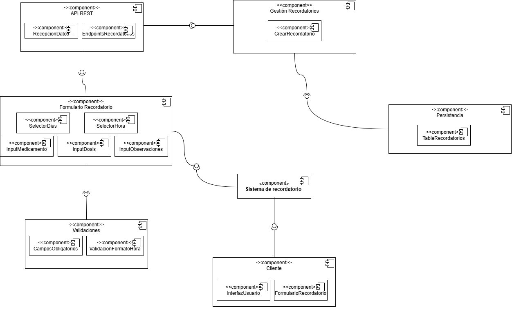
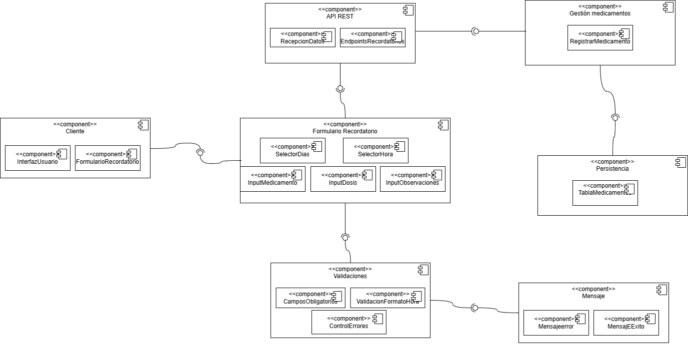
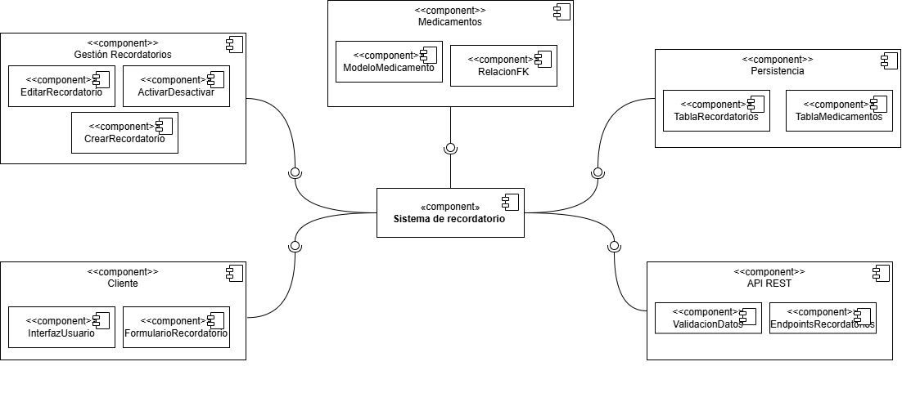

# Diagramas de Componentes

## Descripción general
Este documento reúne los tres diagramas de componentes trabajados para el sistema. En conjunto, muestran cómo se distribuyen las responsabilidades entre la interfaz del usuario, los formularios, las validaciones, la API REST, la lógica de negocio y la persistencia de datos. Cada diagrama representa una vista distinta de funcionalidades clave del proyecto: registro de pacientes, registro de medicamentos y gestión de recordatorios.

---

## 1. Diagrama de componentes — Registro de pacientes

### Explicación
Este diagrama representa los componentes involucrados en la funcionalidad de registro de pacientes. Se observa la participación del cliente, la interfaz de usuario, los formularios de captura, la capa de validaciones, la API REST y la persistencia de datos. Su objetivo es mostrar cómo fluye la información desde la entrada de datos del usuario hasta su almacenamiento en el sistema.

### Justificación
El diagrama es coherente con la arquitectura del proyecto porque refleja la separación entre presentación, lógica de validación, comunicación con el backend y almacenamiento. Esto permite entender cómo el sistema organiza la funcionalidad de registro de pacientes de manera modular.

---

## 2. Diagrama de componentes — Registro de medicamentos

### Explicación
Este diagrama muestra los componentes que intervienen en el registro de medicamentos. Se identifican módulos asociados al formulario, las validaciones, la API REST, la lógica de gestión de medicamentos, la persistencia y los mensajes de retroalimentación al usuario. También permite observar cómo la funcionalidad se conecta con la capa de cliente y con el almacenamiento de la información.

### Justificación
El diagrama representa adecuadamente la estructura del sistema para esta funcionalidad, ya que evidencia la división de responsabilidades entre los distintos componentes. Además, muestra cómo el registro de medicamentos requiere tanto validación de datos como comunicación con la persistencia y respuesta visual al usuario.

---

## 3. Diagrama de componentes — Recordatorios

### Explicación
Este diagrama representa los componentes principales relacionados con la gestión de recordatorios. Se observa un sistema central de recordatorios conectado con módulos de gestión, cliente, medicamentos, persistencia y API REST. A su vez, se muestran subcomponentes específicos como edición, activación, creación de recordatorios, tablas de persistencia y elementos de la interfaz.

### Justificación
El diagrama es acorde con la lógica del sistema porque muestra cómo la funcionalidad de recordatorios depende de varios módulos que trabajan de forma integrada. Esto ayuda a comprender mejor la organización interna de la solución y la relación entre el sistema de recordatorios y otros componentes del proyecto.

---

## Conclusión
Los tres diagramas permiten visualizar la arquitectura por componentes de funcionalidades importantes del sistema. En conjunto, muestran una estructura organizada en capas, donde la interfaz del usuario, la validación, la lógica de negocio, la API REST y la persistencia colaboran para soportar los procesos principales del proyecto.
