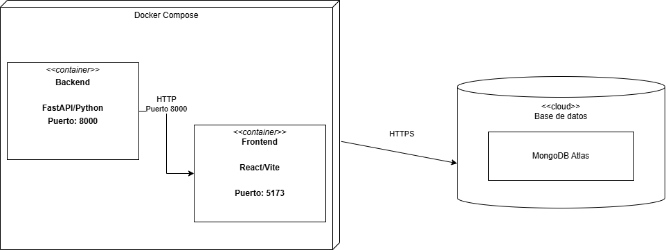

# Diagrama de Despliegue

## Descripción
El diagrama representa cómo se despliega MedTrack usando Docker. Hay tres componentes principales: dos contenedores orquestados por Docker Compose y una base de datos en la nube.

## Justificación
El diagrama es coherente con la arquitectura definida para el proyecto porque representa la separación entre la capa de presentación, la lógica del negocio y la persistencia de datos. Esta organización permite entender cómo se despliega la solución y cómo interactúan sus partes principales en ejecución.

##  Componentes 
##  Docker Compose 
Es el orquestador que levanta y conecta los dos contenedores al mismo tiempo con un solo comando (docker compose up). Sin él, habría que levantar cada contenedor manualmente y configurar cómo se comunican entre sí.

##  Backend
Aquí vive toda la lógica del servidor: los endpoints de autenticación, pacientes, medicamentos, recordatorios y tomas. Cuando el frontend necesita datos, le hace una petición HTTP al puerto 8000 de este contenedor. También es el único que se comunica directamente con MongoDB Atlas.

##  Frontend
Aquí vive la interfaz que ve el cuidador en el navegador. Cuando el usuario abre la aplicación, el navegador carga React desde este contenedor. React luego hace peticiones HTTP al backend en el puerto 8000 para obtener o guardar datos.

##  MongoDB Atlas
Es la base de datos en la nube. No vive en ningún contenedor sino en los servidores de MongoDB. El backend se conecta a ella mediante HTTPS usando el connection string. La ventaja es que todos los miembros del equipo ven los mismos datos en tiempo real sin importar desde dónde corran el proyecto.

