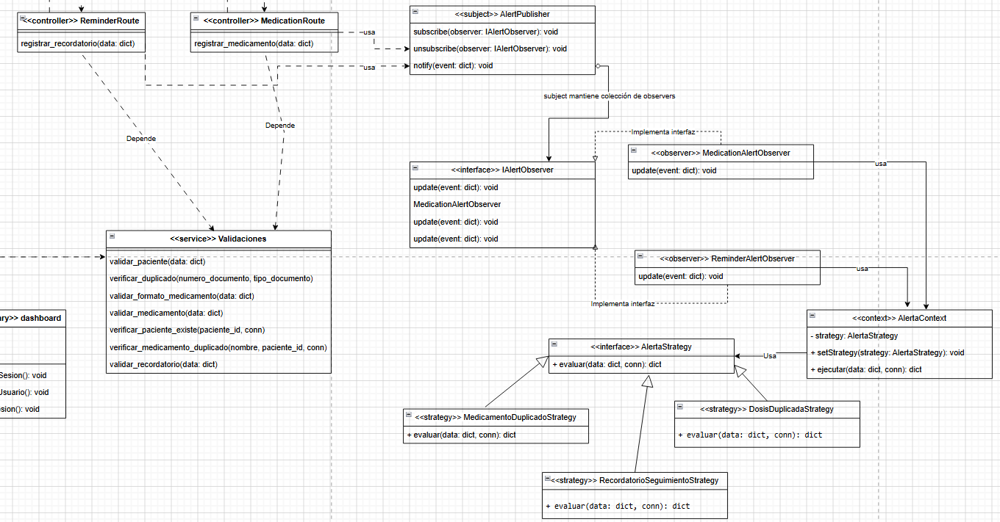

# Patrón Observer

## Descripción
Este diagrama representa la implementación del patrón de diseño comportamental **Observer** en el sistema de alertas. Su propósito es permitir que un objeto central notifique automáticamente a varios observadores cuando ocurre un evento relevante, sin acoplar directamente al emisor con cada uno de los receptores.

## Justificación
El patrón Observer se utiliza para gestionar eventos relacionados con alertas y seguimiento dentro del sistema. Cuando ocurre un evento importante, el objeto central publica la notificación y los observadores concretos reaccionan de manera independiente. Esto permite extender el sistema con nuevos observadores sin modificar la lógica principal del publicador.

## Estructura del patrón en el sistema

### Subject
La clase `AlertPublisher` actúa como sujeto del patrón. Se encarga de mantener la colección de observadores y de notificarles cuando ocurre un evento. Sus operaciones principales son:

- `subscribe(observer: IAlertObserver): void`
- `unsubscribe(observer: IAlertObserver): void`
- `notify(event: dict): void`

### Observer
La interfaz `IAlertObserver` define el contrato común para todos los observadores, mediante la operación:

- `update(event: dict): void`

### Observadores concretos
Los observadores concretos implementan la interfaz y reaccionan según el tipo de evento recibido:

- `MedicationAlertObserver`
- `ReminderAlertObserver`

### Contexto relacionado
El diagrama también muestra la clase `AlertaContext`, la cual utiliza una estrategia (`AlertaStrategy`) para decidir la forma en que se procesan ciertas validaciones o reglas de alertas, complementando la lógica del sistema.

## Relaciones principales
El diagrama evidencia que:

- `AlertPublisher` mantiene una colección de observadores;
- `MedicationAlertObserver` y `ReminderAlertObserver` implementan la interfaz `IAlertObserver`;
- cuando ocurre un evento, el sujeto invoca `update(event)` sobre los observadores suscritos.

## Beneficios en el proyecto
- desacopla el emisor de eventos de los receptores;
- permite reaccionar automáticamente a cambios relevantes;
- facilita agregar nuevos observadores sin modificar el publicador;
- mejora la extensibilidad y el mantenimiento del sistema.

## Conclusión
El patrón Observer resulta adecuado para este módulo porque permite manejar alertas de manera flexible y desacoplada, asegurando que distintos componentes del sistema respondan a eventos importantes sin depender directamente unos de otros.
