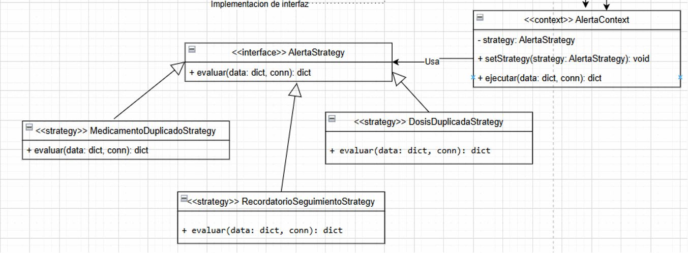

# Patrón Strategy

## Descripción
Este diagrama representa la implementación del patrón de diseño comportamental **Strategy** en el sistema de alertas y validaciones. Su propósito es encapsular diferentes algoritmos bajo una misma interfaz común, permitiendo seleccionar dinámicamente cuál estrategia aplicar según el contexto.

## Justificación
El patrón Strategy se justifica porque el sistema necesita evaluar distintos tipos de reglas sin concentrar toda la lógica en una sola clase. En lugar de usar múltiples condicionales para cada caso, se define una interfaz común y varias estrategias concretas que implementan el mismo método de evaluación. Esto mejora la flexibilidad, facilita la extensión del sistema y reduce el acoplamiento entre las reglas y la clase que las ejecuta.

## Estructura del patrón en el sistema

### Interfaz Strategy
La interfaz `AlertaStrategy` define el contrato común para todas las estrategias mediante la operación:

- `evaluar(data: dict, conn): dict`

Esta abstracción permite que todas las estrategias puedan ser utilizadas de forma uniforme.

### Estrategias concretas
Las estrategias concretas implementan la interfaz y resuelven distintos escenarios del sistema:

- `MedicamentoDuplicadoStrategy`
- `DosisDuplicadaStrategy`
- `RecordatorioSeguimientoStrategy`

Cada una encapsula una regla específica de validación o evaluación.

### Contexto
La clase `AlertaContext` actúa como contexto del patrón. Mantiene una referencia a una estrategia activa y expone las operaciones:

- `setStrategy(strategy: AlertaStrategy): void`
- `ejecutar(data: dict, conn): dict`

El contexto delega la lógica a la estrategia seleccionada, sin conocer los detalles de implementación de cada una.

## Relaciones principales
El diagrama evidencia que:

- `AlertaContext` usa la interfaz `AlertaStrategy`;
- las clases `MedicamentoDuplicadoStrategy`, `DosisDuplicadaStrategy` y `RecordatorioSeguimientoStrategy` implementan dicha interfaz;
- el comportamiento final depende de la estrategia que se configure en tiempo de ejecución.

## Beneficios en el proyecto
- permite cambiar reglas sin modificar la clase cliente;
- reduce el uso de condicionales extensos;
- mejora la extensibilidad del sistema;
- facilita la incorporación de nuevas estrategias futuras;
- favorece un diseño más modular y mantenible.

## Conclusión
El patrón Strategy resulta adecuado para este módulo porque permite separar y encapsular distintas reglas de evaluación bajo una estructura común, haciendo que el sistema sea más flexible, claro y fácil de evolucionar.
