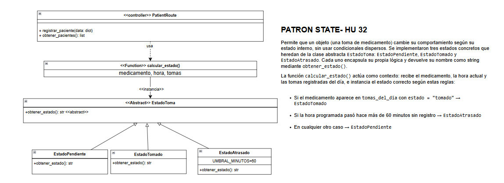

# Patrón State

## Descripción
Este diagrama representa el patrón State, el cual permite que un objeto cambie su comportamiento según el estado en el que se encuentre dentro del sistema.

## Justificación
El patrón State es coherente con la lógica del proyecto porque permite modelar situaciones en las que una entidad cambia su comportamiento dependiendo de su condición actual. Esto resulta útil en el manejo de procesos como el estado de una toma, un recordatorio o una alerta, evitando el uso excesivo de condicionales y mejorando la organización del código.

## Rol dentro del sistema
En este patrón, el estado actual determina la respuesta del sistema ante ciertas acciones. Gracias a esto, se logra una solución más clara, mantenible y fácil de extender si en el futuro se agregan nuevos estados.
