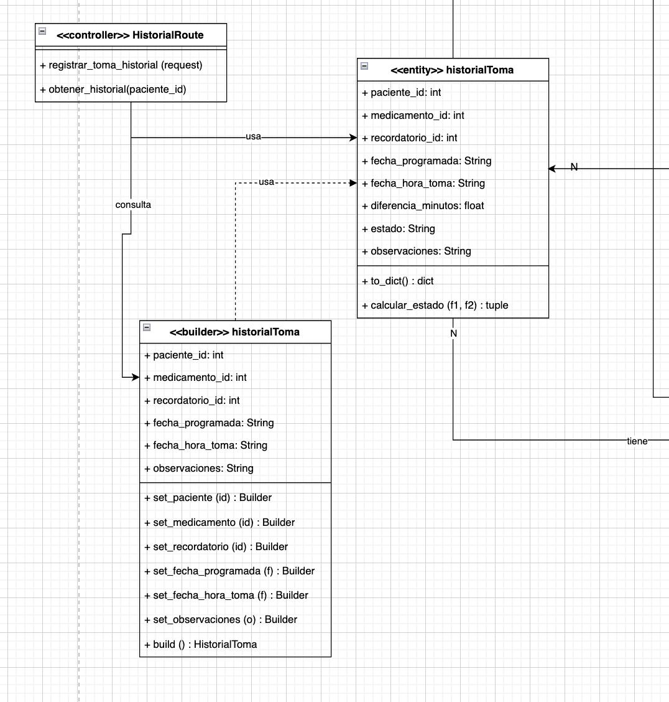

# Patrón Builder — Historial de Tomas

## Descripción
Este diagrama representa la implementación del patrón de diseño creacional **Builder** en el módulo de historial de tomas. El objetivo de este patrón es construir objetos complejos paso a paso, separando el proceso de construcción de la representación final.

## Justificación
El patrón Builder se utiliza porque la entidad `historialToma` requiere varios atributos para quedar correctamente construida, como identificadores de paciente, medicamento y recordatorio, además de fechas, observaciones y estado. En lugar de crear el objeto completo en un solo paso, el builder permite asignar progresivamente cada dato mediante métodos específicos, mejorando la claridad del proceso y reduciendo errores en la creación del objeto.

## Estructura del patrón en el sistema

### Producto
La clase `historialToma` corresponde al producto final. Representa la toma registrada en el sistema y contiene atributos como:

- `paciente_id`
- `medicamento_id`
- `recordatorio_id`
- `fecha_programada`
- `fecha_hora_toma`
- `diferencia_minutos`
- `estado`
- `observaciones`

Además, expone operaciones como:

- `to_dict(): dict`
- `calcular_estado(f1, f2): tuple`

### Builder
La clase `historialToma` marcada como `<<builder>>` corresponde al constructor paso a paso del producto. Sus métodos permiten ir asignando progresivamente los atributos necesarios:

- `set_paciente(id): Builder`
- `set_medicamento(id): Builder`
- `set_recordatorio(id): Builder`
- `set_fecha_programada(f): Builder`
- `set_fecha_hora_toma(f): Builder`
- `set_observaciones(o): Builder`
- `build(): HistorialToma`

### Cliente
El cliente del patrón está representado por `HistorialRoute`, que utiliza el builder para consultar o registrar información antes de obtener finalmente una instancia construida de `historialToma`.

## Relaciones principales
El diagrama evidencia que:

- `HistorialRoute` interactúa con el builder;
- el builder va configurando cada atributo requerido;
- al final, `build()` retorna el objeto `historialToma` completo.

## Beneficios en el proyecto
- organiza mejor la creación de objetos con múltiples atributos;
- hace más claro y controlado el proceso de construcción;
- evita constructores demasiado largos o difíciles de leer;
- facilita futuras extensiones en la creación de tomas históricas.

## Conclusión
El patrón Builder resulta adecuado para este módulo porque permite construir objetos de historial de manera progresiva, clara y segura, manteniendo desacoplado el proceso de construcción respecto al objeto final.
