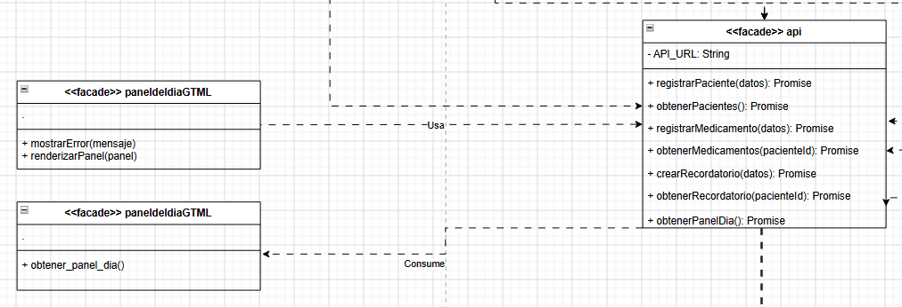

# Patrón Fachada — Panel del día

## Descripción
Este diagrama representa la aplicación del patrón de diseño **Fachada** en la funcionalidad del panel del día. En esta implementación, la vista `panelDia.HTML` actúa como cliente y utiliza el objeto `api` como punto de acceso unificado hacia el backend. De esta manera, la interfaz no realiza llamadas directas al servidor, sino que delega la operación a la fachada mediante el método `obtenerPanelDia()`.

## Justificación
El uso de la Fachada se justifica porque simplifica la comunicación entre la interfaz y el backend. En lugar de que la vista conozca directamente las rutas o la lógica interna del sistema, todo el acceso se concentra en `api.js`, que encapsula la llamada al endpoint `GET /panel-dia`. Esto reduce el acoplamiento, evita duplicación de código y mejora la mantenibilidad de la solución.

## Estructura del patrón en el sistema

### Cliente
`panelDia.HTML` actúa como cliente del patrón. Su responsabilidad es solicitar la información y renderizarla en pantalla mediante funciones como `mostrarError(mensaje)` y `renderizarPanel(panel)`.

### Fachada
La clase `api` corresponde a la fachada. Allí se centralizan las llamadas al backend y se expone una interfaz más simple para el frontend. En este caso, el método relevante es:

- `obtenerPanelDia(): Promise`

### Subsistema
El subsistema está representado por el endpoint:

- `GET /panel-dia`

Este endpoint procesa la solicitud y retorna la información consolidada del panel.

## Flujo
1. La vista `panelDia.HTML` solicita la información del panel.
2. La llamada se realiza a través de `api.obtenerPanelDia()`.
3. La fachada encapsula el acceso al backend.
4. El endpoint `GET /panel-dia` responde con la información del panel.
5. La vista renderiza el contenido recibido.

## Beneficios en el proyecto
- centraliza las llamadas al backend en un solo punto;
- reduce el acoplamiento entre la interfaz y la lógica de acceso a datos;
- mejora la reutilización del código;
- facilita el mantenimiento y futuras extensiones del frontend.

## Conclusión
La actualización del panel del día fortalece el uso del patrón Fachada, ya que la vista accede a la funcionalidad mediante una interfaz simplificada (`api`) y no depende directamente de los detalles internos del backend.
